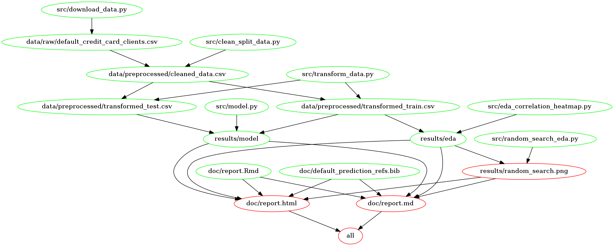

# Credit Default Payment Predictor

-   Authors: Arushi Ahuja, Karanpreet Kaur, Lianna Hovhannisyan, Taiwo
    Owoseni

Using Logistic Regression to predict whether the customer will do credit
default payment next month or not.

## About

In this project, we built a classification model using Logistic
Regression to predict if credit account holders will make a default
payment next month. Default payment refers to a situation when a
borrower, on interest or principal owed, is unable to make timely
payments, misses payments, or avoids/ stops making payments.

The model was trained on features that hold information about the
client’s last 6 months bill and payment history, as well as several
other characteristics such as: age, marital status, education, and
gender. We consider the positive class to be default (client made a
default payment). Overall, we are more interested in minimizing Type I
error (predicting no default payment, when in reality the client made a
default payment the following month), as opposed to Type II error
(predicting default payment, when in reality no default payment was made
by the client). However, given the fact that for creditors it is at
upmost importance to have as minimal error prompt model as possible, we
will use *f*1 as our primary scoring metric. *f*1 score is the harmonic
mean of recall (shows how many among all positive examples are correctly
identified) and precision (shows how many among the positive examples
are actually positive) score, thus providing a good idea about both
scores.

Our model’s test *f*1 score is \~0.53 with recall and precision rate
being \~0.48, \~0.59 respectively. We also report
average_precision_score (AP) as it summarizes a precision-recall curve:
the weighted mean of precision achieved at each threshold, with the
increase in recall from the previous threshold used as the weight. This
score tells us the overall model performance on imbalance dataset.
Overall, we conclude that the model can correctly classify default
payments roughly half of the time.

The value of incorrectly identifying default or no default can cause a
lot of money and reputation to the company, we recommend continuing
study to improve this prediction model before it is put into production
in the credit companies. Some of the improvement research topics can be
feature engineering, bigger dataset collected from other countries
(China, Canada, Japan).

The data set used in the project is created by Yeh, I. C., and Lien, C.
H (Yeh and Lien 2009), and made publicly available for download in UCI
Machine Learning Repository (“default of credit
card clients” 2016). The data can be found
[here](https://archive-beta.ics.uci.edu/ml/datasets/default+of+credit+card+clients),
specifically [this
file](https://archive.ics.uci.edu/ml/machine-learning-databases/00350/default%20of%20credit%20card%20clients.xls).
The dataset is based on Taiwan’s credit card client default cases from
April to September. It has 30000 examples, and each example represents
particular client’s information. The dataset has 24 observations with
respective values such as gender, age, marital status, last 6 months
bills, last 6 months payments, etc, including the final default payment
of next month column: labeled 1 (client will make a default) and 0
(client will not make a default).

## Report

The final report can be found
[here](https://htmlpreview.github.io/?https://github.com/UBC-MDS/credit_default_prediction/blob/main/doc/report.html).

The link to the Milestone 3 release can be found
[here](https://github.com/UBC-MDS/credit_default_prediction/releases/tag/0.1.1).

## Usage

– To replicate the analysis, please clone this GitHub repository.

There are two suggested ways to run this analysis:

### Method 1. Using Docker

To replicate the analysis, install
[Docker](https://www.docker.com/get-started). Then run the following
command at the command line/terminal from the root directory of this
project:

To replicate the analysis, install Docker. Then clone this GitHub
repository and run the following command at the command line/terminal
from the root directory of this project:

    docker run --rm -v /$(pwd):/home/rstudio/credit_default_prediction aahuja28/credit_default_prediction make -C /home/rstudio/credit_default_prediction all

To reset the repo to a clean state, with no intermediate or results
files, run the following command at the command line/terminal from the
root directory of this project:

    docker run --rm -v /$(pwd):/home/rstudio/credit_default_prediction aahuja28/credit_default_prediction make -C /home/rstudio/credit_default_prediction clean

### 2. Without using Docker

– To set up the necessary packages for running the project, download the
environment file from
[here](https://github.com/UBC-MDS/credit_default_prediction/blob/main/environment.yaml):
hit “Raw” and then Ctrl/Cmnd + S to save it, or copy paste the content.
Then create a Python virtual environment by using conda with the
environment file you just downloaded:

    conda env create --file environment.yaml

– Run the following command from the environment where you have
JupyterLab installed (e.g. base).

    conda install nb_conda_kernels

Note: For the `credit_default_prediction_report.Rmd` to run, you need to
Specify that {reticulate} should use the miniconda version of Python
from this created environment in your `.Rprofile` file:

-   Type `usethis::edit_r_profile()` into the R console inside RStudio.
    This would open `.Rprofile` file from HOME directory in RStudio. Add
    this to your .Rprofile file replacing the path set before.:
    `Sys.setenv(RETICULATE_PYTHON = "path_to_miniconda's_python for credit_default_env")`

-   In Windows, you need `\\` instead of a ` ` to separate the
    directories, for example your path should be like:
    `C:\\Users\\hp\\miniconda3\\envs\\credit_default_env\\python.exe`

-   To make altair plots save in .png with conda environment in make
    file, you need to install these extra dependencies on your
    environment using below commands `npm install -g vega`
    `npm install -g vega-cli vega-lite canvas`

After the environment is set up, follow up the instructions below.

– To replicate the analysis, run the following command at the command
line/terminal from the root directory of this project:

`make all`

To reset the repo to a clean state, with no intermediate or results
files, run the following command at the command line/terminal from the
root directory of this project:

`make clean`

## Makefile’s dependency graph

## Dependencies

-   ipykernel
-   python=3.8
-   matplotlib>=3.2.2
-   scikit-learn>=1.0
-   pandas>=1.3.\*
-   numpy
-   requests>=2.24.0
-   graphviz
-   python-graphviz
-   pip
-   make
-   seaborn
-   eli5
-   imbalanced-learn
-   ipython>=7.15
-   altair_saver
-   docopt==0.6.2
-   openpyxl==3.0.9
-   xlrd==2.0.1
-   altair==4.1.0
-   portpicker==1.5.0
-   jupyterlab==3.2.4
-   pip:
    -   mglearn
    -   psutil>=5.7.2

## License

This dataset is licensed under a Creative Commons Attribution 4.0
International (CC BY 4.0) license. This allows for the sharing and
adaptation of the datasets for any purpose, provided that the
appropriate credit is given.

# References

“default of credit card clients.” 2016. UCI
Machine Learning Repository.

Yeh, I-Cheng, and Che-hui Lien. 2009. “The Comparisons of Data Mining
Techniques for the Predictive Accuracy of Probability of Default of
Credit Card Clients.” *Expert Syst. Appl.* 36: 2473–80.

