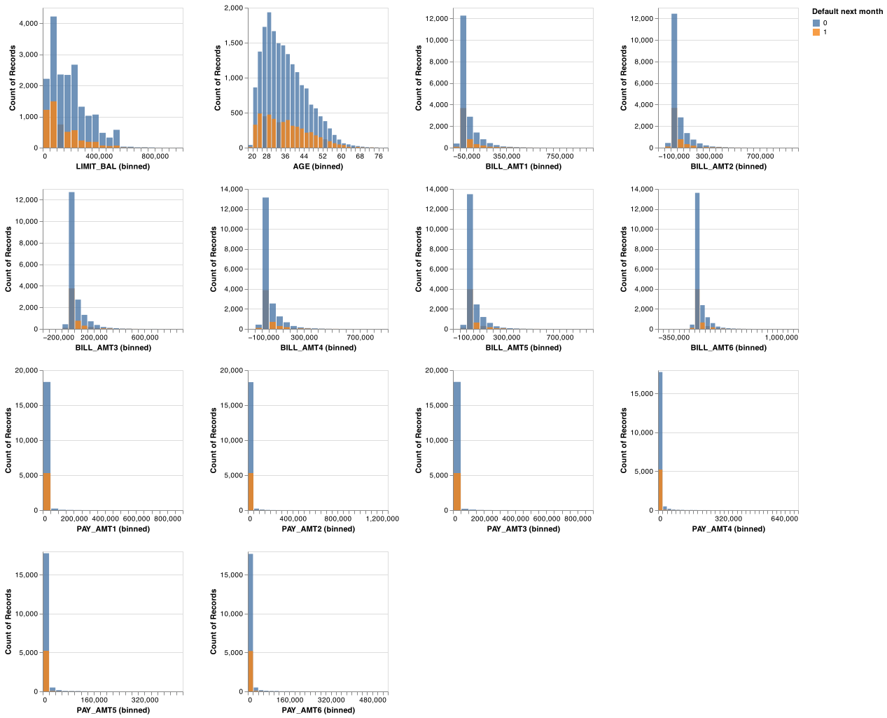
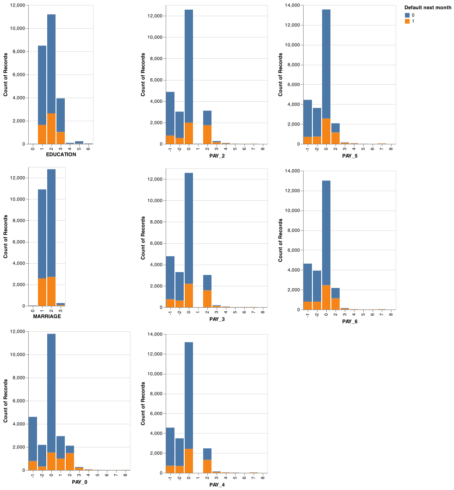

```{r setup, include=FALSE}
knitr::opts_chunk$set(echo = FALSE)
library(knitr)
#library(kableExtra)
library(tidyverse)
```

```{r load model results}
# model <- read.csv("../results/...")
```

## Summary

In this project, we built a classification model using Logistic Regression to predict if the credit account holders will make a default payment or not next month. The model was trained on features that hold information about the client's last 6 months bill and payment history, as well as several characteristics: age, marital status, gender, etc. Overall, we are more interested in minimizing Type | error (predicting not default payment, when in reality client made a default payment next month) and Type || error (predicting default payment, when in reality client did not do default next month), we are using primarily $f1$ as scoring metric. Our model performed fairly well

## Introduction

An account is considered the default when the client does not make the minimum payment for a consecutive 6 months period. Predicting potential credit default accounts is challenging but at the same time crucial for credit card companies. The default can happen for various reasons: the loss of a job, change in the financial market, personal difficulties, inability to work, health issues, need to use the extra cash for other bills, etc. All of the described can be considered as "out-of-control" from the customers' side. However, the default can also be intentional. An example of intentional default is when the client knows that they are no longer financially stable enough for the credit, but continue to use it until the bank intervenes [@Islam2018CreditDM]. The existence of such loopholes makes it essential for creditors to detect default accounts as soon as possible. In general, for creditors earlier they detect the potential default accounts, the lower the losses for the company [@SyedNor2019PersonalBP].

Here we ask if we can use a machine-learning algorithm to predict whether the customer will do default payment next month or not. The detection of default depends on extensive data profiling of customer's finance, including their age, payment history, marriage status, gender, education. For the creditors, it is most important to have the model that predicts the account's next month's status, especially if the client is going to make a default payment. The correct prediction will help creditors to plan their risk management and take according to actions before the situation gets out of control.

## Methods

### Data

The data set used in the project is created by Yeh, I. C., and Lien, C. H [@Yeh2009TheCO], and made publicly available for download in UCI Machine Learning Repository [@misc_default_of_credit_card_clients_350]. The data can be found [here](<https://archive-beta.ics.uci.edu/ml/datasets/default+of+credit+card+clients>), specifically [this file](<https://archive.ics.uci.edu/ml/machine-learning-databases/00350/default%20of%20credit%20card%20clients.xls>). The dataset is based on Taiwan's credit card client default cases from April to September. It has 30000 examples, and each example represents one client's information. The dataset has 24 observations with respective values such as gender, age, marital status, last 6 months bills, last 6 months payments, etc, including the final default payment of next month column: labeled 1 (client will make a default) and 0 (client will not make a default).   

### Analysis

The Logistic Regression algorithm was used to build a classification model for the default credit card dataset to predict whether the client will make a default payment or not in the next month (can be found in the "default payment next month" column with binary label). All the features included in the original dataset were used for tuning and fitting the model. The hyperparameter $C$ was chosen using 10 cross-validations with f1 score as scoring metrics. The Python programming language [@Python] and the following Python packages were used for the model analysis: docopt [@docoptpython], sklearn [@sklearn_api], altair [@vanderplas2018altair]; as well as R programming language [@R] for generating this report and the following packages: knitr [@knitr], tidyverse [@tidyverse]. The code used to perform the analysis and create the report can be found [here](https://github.com/UBC-MDS/credit_default_prediction).

### Results & Discussion

-   EDA

In order to understand which features play an important role in the decision making and prediction within the model, we will look at the distributions of each feature individually either through bar graphs or histograms depending on the type of feature, and we will also be grouping them by the 2 target classes. Here the target classes are: "1" if default payment was made meaning that the client did not pay their credit on time, and "0" if no default payment was made meaning that the client did pay their credit on time. It is important to note that because this is the preliminary analysis before any transformations or model making, the visualizations do not take into account the class imbalance and so while we may come to conclusions about the features right now, they may contain a certain amount of bias to them. 

For the numerical features, we will be looking at their histograms and will be mainly focusing on how the target classes overlap with each other for each feature.
Less overlap between target classes in general would indicate to creating a more realistic model, this is because the model would be able to easily classify the target classes given the difference in values of the features for each target class. Furthermore, this would give us an idea of which features we could potentially give more importance to and exactly how to define our predictive model. From Figure 1, we see that most features show very little overlap, telling us that right now it would not be wise to remove any feature from the analysis. 

For the ordinal and categorical features such as sex, education, and whether a client has payed their past month credit or not, instead of looking at the histograms, we instead will be looking at the bar graphs in order to understand the proportions of the target classes in each of the categories in all features. Since the categories for the features are classified by numbers, here I will provide an explanation for what the numbers represent in each feature: 

- SEX: 1 depicts male and 2 depicts female.
- PAY_0 - PAY_6 : -2 represents balance paid in full and no transactions in this period (we may refer to this credit card account as having been 'inactive' this period).-1 represents pay duly, but customer's account has a positive balance at end of period due to recent transactions for which payment has not yet come due.
0 represents customer paid the minimum due amount, but not the entire balance. And finally, positive numbers represent payment delays by those many number of months, so for example PAY_0 is 1, then the payment is delayed by one month. 
- MARRIAGE: 1 depicts married, 2 depicts single and 3 depicts others.
- EDUCATION: 1 depicts graduate school, 2 depicts university, 3 depicts high school and 4 depicts others.

On looking at the bar graphs in Figure 2, it is hard to say which features could play a more important role in the predictions, in general we see that proportions for "0" target class are higher for each category in all features. 

```{r histogram_numeric_feat, echo=FALSE, fig.cap="Figure 1. Comparison of distributions for the numerical features of the training data set grouped by target classes", out.width = '100%'}

```

```{r bar_categorical_feat, echo=FALSE, fig.cap="Figure 2. Comparison of proportions for the categorical and ordinal features of the training data set grouped by target classes", out.width = '100%'}

```
- Analysis

- EDA: confidence interval plot

During model building, a key step in creating a accurate and realistic model is finding the best hyperparameter values for the model that minimizes both underfitting and overfitting during prediction. Figure 3 gives a glimpse on how we went about finding the best hyperparameters for the Logistic Regression model. Here the 2 hyperparameter we are finding values for are:
- "C" which defines the complexity of the model. Higher value of C means a more complex model.
- "class weights" which can be only two values "balanced" or None . If "class weights" is "balanced" then that means we are treating all features equally in the decision making process during prediction. 

After carrying out Random Search cross validation with 10 folds, Figure 3 shows the different combination of the two hyperparamters along with the scores of those models. We see that the model provides the best score with "class weights" equal to "balanced" and "C" equal to 0.1. 

```{r bar_categorical_feat, echo=FALSE, fig.cap="Figure 3. Comparison of scores while tuning hyperparamters for the Logistic Regression model", out.width = '100%'}
knitr::include_graphics("../results/random_search.png")
```

## References
