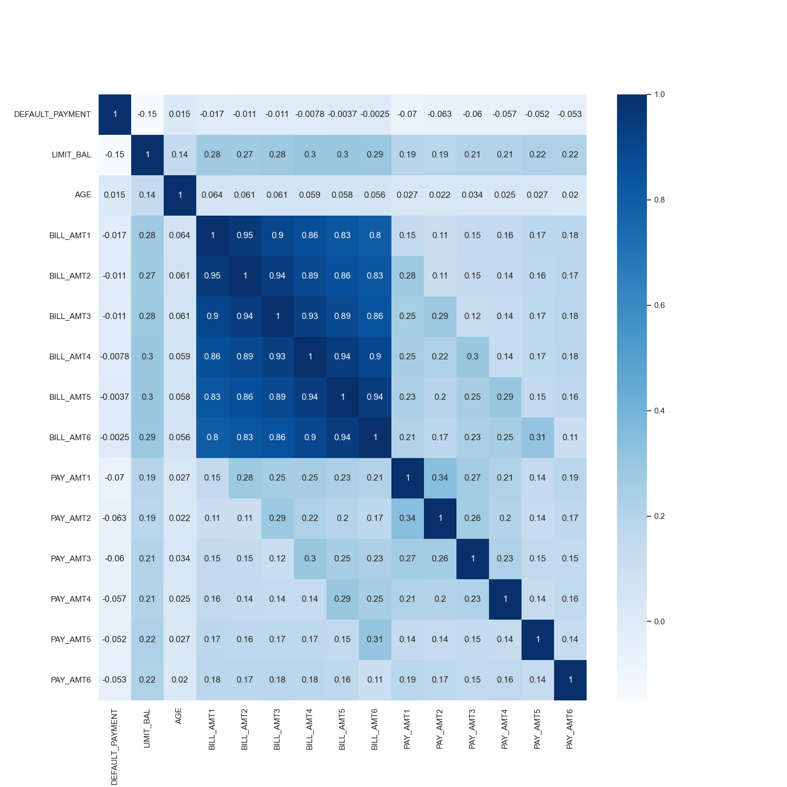
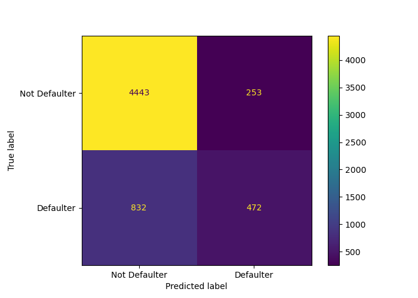
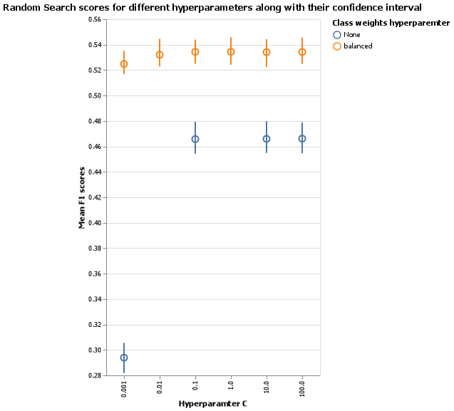
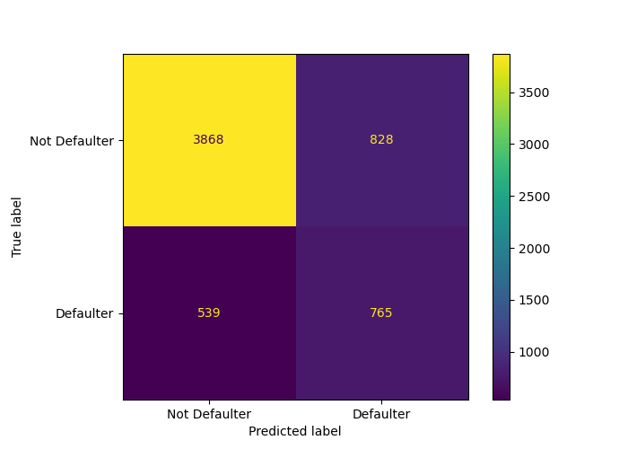

```{r setup, include=FALSE}
knitr::opts_chunk$set(echo = FALSE)
library(reticulate)
```

```{python load model results, include=FALSE}
import pandas
import pickle
import matplotlib.pyplot as plt
from sklearn.metrics import ConfusionMatrixDisplay, classification_report, accuracy_score, average_precision_score, roc_auc_score
test_df = pandas.read_csv('../data/preprocessed/transformed_test.csv')

# Split test data into input and target 
X_test = test_df.drop(columns = ['DEFAULT_PAYMENT_NEXT_MONTH'])
y_test = test_df['DEFAULT_PAYMENT_NEXT_MONTH']

default_model = pickle.load(open('../results/model/default_lr_model.pkl', 'rb'))
final_tuned_model = pickle.load(open('../results/model/final_tuned_model.pkl', 'rb'))

y_pred_default = default_model.predict(X_test)
y_pred_tuned = final_tuned_model.predict(X_test)

default_model_score = round(default_model.score(X_test, y_test), 3)

conf_matrix_default = ConfusionMatrixDisplay.from_predictions(
                      y_test, y_pred_default, display_labels=["Not Defaulter", "Defaulter"])

default_classification_report = classification_report(y_test, y_pred_default, output_dict = True)

default_classification_recall = round(default_classification_report["1"]["recall"], 3)

default_classification_precision = round(default_classification_report["1"]["precision"], 3)

default_classification_f1_score = round(default_classification_report["1"]["f1-score"], 3)

default_classification_average_precision = round(average_precision_score(y_test, y_pred_default), 3)

default_classification_roc_auc = round(roc_auc_score(y_test, y_pred_default), 3)

final_tuned_model_score = round(accuracy_score(y_test, y_pred_tuned), 3) # Accuracy score

conf_matrix_tuned = ConfusionMatrixDisplay.from_predictions(
                      y_test, y_pred_tuned, display_labels=["Not Defaulter", "Defaulter"])

final_tuned_classification_report = classification_report(y_test, y_pred_tuned, output_dict = True)

final_tuned_classification_recall = round(final_tuned_classification_report["1"]["recall"], 3)

final_tuned_classification_precision = round(final_tuned_classification_report["1"]["precision"], 3)

final_tuned_classification_f1_score = round(final_tuned_classification_report["1"]["f1-score"], 3)

final_tuned_classification_average_precision = round(average_precision_score(y_test, y_pred_tuned), 3)

final_tuned_classification_roc_auc = round(roc_auc_score(y_test, y_pred_tuned), 3)

```


## Summary

In this project, we built a classification model using Logistic Regression to predict if credit account holders will make a default payment next month. The model was trained on features that hold information about the client’s last 6 months bill and payment history, as well as several other characteristics such as: age, marital status, education, and gender. We consider the positive class to be default (client made a default payment). Overall, we are more interested in minimizing Type I error (predicting no default payment, when in reality the client made a default payment the following month), as opposed to Type II error (predicting default payment, when in reality no default payment was made by the client). However, given the fact that for creditors it is at upmost importance to have as minimal error prompt model as possible, we will use $f1$ as our primary scoring metric. $f1$ score is the harmonic mean of recall (shows how many among all positive examples are correctly identified) and precision (shows how many among the positive examples are actually positive) score providing a good idea about both scores. 

Our model's test $f1$ score is `r py$final_tuned_classification_f1_score` with recall and precision rate being `r py$final_tuned_classification_recall`, `r py$final_tuned_classification_precision` respectively. We also report average_precision_score (AP) as it summarizes a precision-recall curve: the weighted mean of precision achieved at each threshold, with the increase in recall from the previous threshold used as the weight. This score tells us the overall model performance on imbalance dataset. Overall, we conclude that the model can correctly classify default payments roughly half of the time. 

The value of incorrectly identifying default or no default can cause a lot of money and reputation to the company, we recommend continuing study to improve this prediction model before it is put into production in the credit companies. Some of the improvement research topics can be feature engineering, bigger dataset collected from other countries (China, Canada, Japan).


## Introduction

Default payment refers to a situation when a borrower is unable to make timely payments, misses payments, avoids/stops making payments on interest or principal owed. An account is considered a default when the minimum payment is not made for a consecutive 6 months period. Predicting potential credit default accounts is challenging but at the same time crucial for credit card companies. The default can happen for various reasons: the loss of a job, change in the financial market, personal difficulties, inability to work, health issues, need to use the extra cash for other bills, etc. All of the examples described can be considered as "out-of-control" from the customers' side. However, the default can also be intentional. An example of intentional default is when the client knows that they are no longer financially stable enough for credit, but continues to use credit until the bank intervenes [@Islam2018CreditDM]. The existence of such loopholes makes it essential for creditors to detect default accounts as soon as possible. In general for creditors, the earlier they detect the potential default accounts, the lower their losses will be [@SyedNor2019PersonalBP].

Here we ask if we can use machine-learning algorithms to predict whether a customer will do a default payment next month or not. The detection of default depends on extensive data profiling of customer's finance, along with other information such as their age, payment history, marriage status, gender, education. For the creditors, it is most important to have the model that predicts the account's next month's status, especially if the client is going to make a default payment. The correct prediction will help creditors to plan their risk management and take steps before the situation gets out of control.

## Methods

### Data

The data set used in the project is created by Yeh, I. C., and Lien, C. H [@Yeh2009TheCO], and made publicly available for download in UCI Machine Learning Repository [@misc_default_of_credit_card_clients_350]. The data can be found [here](<https://archive-beta.ics.uci.edu/ml/datasets/default+of+credit+card+clients>), specifically [this file](<https://archive.ics.uci.edu/ml/machine-learning-databases/00350/default%20of%20credit%20card%20clients.xls>). The dataset is based on Taiwan's credit card client default cases from April to September. It has 30000 examples, and each example represents particular client's information. The dataset has 24 observations with respective values such as gender, age, marital status, last 6 months bills, last 6 months payments, etc, including the final default payment of next month column: labeled 1 (client will make a default) and 0 (client will not make a default).   

### Analysis

As mentioned previously, our data set consists of 30000 observations, which we consider as the large enough sample for using Logistic Regression as the primary method. In addition, the features, that are being used to train the model on, are relevant to the target class, thus Logistic Regression will give us the results that are reliable, and easy to interpret to stakeholders. Moreover, Logistic Regression algorithm is one of the most popular ways to fit models for categorical data, especially for binary response data in data modeling. 

Therefore, we choose to conduct analysis and build a classification model for the default credit card dataset using Logistic Regression. The question in hand is to predict whether the client will make a default payment in the next month (can be found in the “default payment next month” column with binary label). 

Before starting the tuning, we splited our data set into train and test sets. 20% of the observations will be included in the test data and 80% in the train data set. The split will ensure the needed balance for having enough data for the fitting and cross validation set, as well as large enough test data for the final affirmation of the model: more precisely, the train set will have 24000 observations, and test set 6000. To have generalizable results, cross validation was carried out on the train set with 10 folds. The best hyperparameters (C and class_weight) were chosen by randomized search.

All the features included in the original dataset were used for tuning and fitting the model. The hyperparameter $C$, $class\_weight$ were chosen using 10 cross-validations with $f1$ score as primary scoring metric (recall and average precision also considered). The Python programming language [@Python] and the following Python packages were used for the model analysis: docopt [@docoptpython], sklearn [@sklearn_api], altair [@vanderplas2018altair], pandas [@mckinney2010data], numpy [@2020NumPy-Array], os [@Python], requests [@chandra2015python], pickle [@van1995python], matplot [@hunter2007matplotlib], seaborn [@michael_waskom_2017_883859]; as well as R programming language [@R] for generating this report and the following packages: knitr [@knitr], tidyverse [@tidyverse]. The code used to perform the analysis and create the report can be found [here](https://github.com/UBC-MDS/credit_default_prediction).

## Results & Discussion

### Understanding the relationship between features and target class 

In order to understand which features play an important role in the decision making and prediction within the model, we will be analyzing the correlations between features and also how they correlate to the target class. So that we can get the most accurate correlations, we are looking at the transformed data and eliminating any sort of initial biases in the data. Note that correlation numbers range anywhere between -1 to 1, here we will be calculation correlation numbers between either two feature or a feature and a target class. Negative numbers indicate a negative correlation, which means that if we are looking the correlation number between two features, it could be that if one feature value increases the other feature value decreases (and vice versa), -1 is highest possible negative correlation. Similarly positive numbers indicate a positive correlation, which means that if we are looking the correlation number between two features, it could be that if one feature increases the other feature also increases (and vice versa), +1 is the highest possible positive correlation. Lastly, zero represent no correlation between the two variables. It is important to note that we don't exactly know which direction the correlation is pointing, however in our case we are more concerned with seeing which features would play a higher role in the decision making of the model. 

Figure 1 plots the correlation heat map, here there are two major observations: 

(1) We see high positive correlations among the `BILL_AMT` features, those features represent the bill amount for each month for 6 months going from April to September, 2005 (where `BILL_AMT1` represents bill amount for April). This positive correlation can indicate to two things: higher bill amounts in a month would most likely lead to higher amounts in the next month, and secondly those higher amounts in the next month can be associated with client's bill amounts accumulating because they haven't made their payments on time. 

(2) We see that most of the feature firstly have low correlation in general with the target feature. Additionally, most of them show a negative correlation with the target feature. 

<center>



Figure 1. Correlation heatmap with features and target class

</center>

### The evaluation of the method
With the accuracy as the scoring metric, the Logistic regression prediction model produced good results, with the test accuracy of **`r py$default_model_score`**. However, as our project focuses on predicting the clients with credit defaults, it’s crucial for our model to predict Defaulter class correctly and minimize the misclassification error. To identify the actual errors made by the model, we checked the values of metrics **recall, precision and f1 score** for **Defaulter class**: **recall = `r py$default_classification_recall`, precision = `r py$default_classification_precision`, f1_score = `r py$default_classification_f1_score`**. It can be observed that the recall for Defaulter class is significantly less than the precision. The detailed classification of classes in terms of numbers can be seen below. The **AP score** is **`r py$default_classification_average_precision`** which is every low for this case due to large number of misclassifications for Defaulter class (i.e. higher FN's). The detailed classification of classes in terms of numbers can be seen below.


```{python Save confusion_matrix_default, include=FALSE}
conf_matrix_default.plot()
plt.savefig("../results/confusion_matrix_default.png")
```

<center>

<!-- -->

Figure 2. Confusion matrix of Logistic Regression model with default parameters

</center>

The reason for such large number of Type II errors (False negatives) could be due to class imbalance in data set. So, to identify and minimize the effect of imbalance, we choose to change the training procedure by taking advantage of sklearn parameter called class_weight. class_weight = 'balanced' gives higher weight to minority class (1) and lower weight to majority class (0) to balance out their representation in the dataset.

Hyperparameter tuning was performed on the Logistic regression model for C and class_weight hyperparameters using RandomizedSearchCV. C hyperparameter defines the complexity of the model: higher value of C means a more complex model. Since C value determines the log loss on the dataset, we have will be testing out values [0.001, 0.01, 0.1, 1, 10, 100, 1000] for C, and for class_weight hyperparamter we will be testing out values ['None', 'balanced']. It is important to note that there are some limitations to using RandomizedSearchCV as opposed to other methods to find the best hyperparamters, one such limitation is that it may not necessarily find the best hyperparamters, it is not exhaustive and will only look at a few different combinations. However, RandomizedSearchCV is much more faster and flexible with large datasets like ours. 

After carrying out Random Search cross validation with 10 folds, Figure 3 shows the different combination of the two hyperparamters along with the scores of those models. We see that the model provides the best score with class weights equal to “balanced” and C equal to 0.1.  These returned best parameters were used to evaluate the model on the test data.

<center>

<!-- -->

Figure 3. Comparison of scores while tuning hyperparamters for the Logistic Regression model

</center>


The model from random search gives **test accuracy score** of **`r py$final_tuned_model_score`** and metrics **recall, precision and f1-score** for **Defaulter class** are **`r py$final_tuned_classification_recall`,  `r py$final_tuned_classification_precision`, `r py$final_tuned_classification_f1_score`** respectively. Thus, through hyperparameter tuning, we were able to achieve higher recall and f1-score. However, there is always trade-off between recall and precision, as evidenced with the lower precision score for the tuned model. The **AP score** is **`r py$final_tuned_classification_average_precision`** which is even lower than we received earlier but since we want to minimize the misclassifications on Defaulter class (FN), the False positives would increase and hence average precision would decrease. There is always a tradeoff between recall and precision and the correct amount of trade-off or accepted recall and precision score is somewhat business dependent as these scores highly impact the business costs and strategies. The detailed classification of target can be seen below:

```{python Save confusion_matrix_tuned, include=FALSE}
conf_matrix_tuned.plot()
plt.savefig("../results/confusion_matrix_tuned_model.png")
```

<center>

<!-- -->

Figure 4. Confusion matrix of tuned Logistic Regression model with hyperparameters

</center>

### Conclusion

To conclude, even though the scores are not very high, we believe our model is generalizable for the unseen data. However, given the importance for the companies to have high rates for predicting the Default class, we acknowledge that our model may not be the best suit for the most companies.In future, as we grow our knowledge on new techniques of handling such datasets, we will keep contributing to this project for improvement.

### Discussion
To further improve this model in future with hopes that it will be used for credit companies, there are several things we can suggest. Firstly, feature engineering can help us boost our $f1$ score. We believe that the expert knowledge will help to dive deeper into the problem and add features such as the combination ratio of payment and bill, to help our model to rank the features more accurately. Secondly, we will try other classification algorithms such as Random Forest, with the hopes of getting better score and less error pron model. Finally, we will collect more data from other countries such as China, Canada, Japan to have bigger understanding of the trends in default credit payment and train our model with larger data set.

## References
