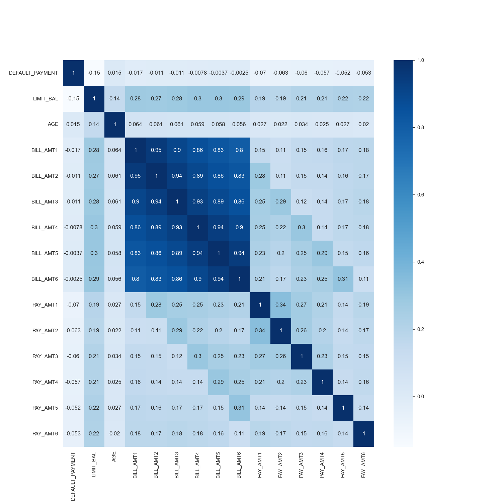
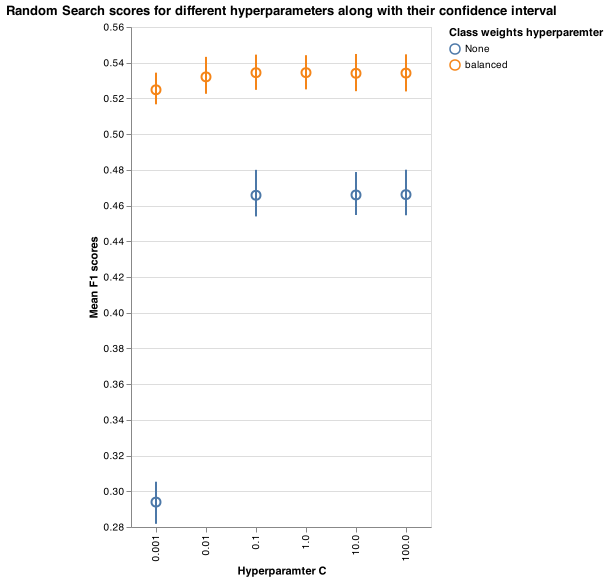

Predicting credit default payments from client’s payment history
================
Lianna Hovhannisyan, Arushi Ahuja, Taiwo Owoseni, Karanpreet Kaur
25/11/2021

-   [Summary](#summary)
-   [Introduction](#introduction)
-   [Methods](#methods)
    -   [Data](#data)
    -   [Analysis](#analysis)
    -   [Results & Discussion](#results--discussion)
    -   [Overview of the method](#overview-of-the-method)
    -   [The evaluation of the method](#the-evaluation-of-the-method)
    -   [Discussion](#discussion)
-   [References](#references)

## Summary

In this project, we built a classification model using Logistic
Regression to predict if credit account holders will make a default
payment next month. The model was trained on features that hold
information about the client’s last 6 months bill and payment history,
as well as several other characteristics such as: age, marital status,
education, and gender. Overall, we are more interested in minimizing
Type I error (predicting no default payment, when in reality the client
made a default payment the following month), as opposed to Type II error
(predicting default payment, when in reality no default payment was made
by the client), we are using *f*1 as our primary scoring metric. Our
model performed fairly well on test data set with the *f*1 score being
0.528. Our recall and precision rate are moderately high, being 0.587,
0.48 respectively. We would also report average_precision_score (AP) as
it summarizes a precision-recall curve as the weighted mean of
precisions achieved at each threshold, with the increase in recall from
the previous threshold used as the weight and that would tell us that
the overall model performance on imbalance dataset. The given scores are
consistent with the train data set scores, thus we can say that the
model is generalizable on unseen data. However, the scores are not high,
and our model is error prompt. The model can correctly classify default
payments roughly half of the time. The value of incorrectly identifying
default or no default can cause a lot of money and reputation to the
company, thus we recommend continuing study to improve this prediction
model before it is put into production in the credit companies. Some of
the improvement research topics can be feature engineering, bigger
dataset collected from other countries (China, Canada, Japan).

## Introduction

An account makes a default payment when the minimum payment is not made
for a consecutive 6 months period. Predicting potential credit default
accounts is challenging but at the same time crucial for credit card
companies. The default can happen for various reasons: the loss of a
job, change in the financial market, personal difficulties, inability to
work, health issues, need to use the extra cash for other bills, etc.
All of the examples described can be considered as “out-of-control” from
the customers’ side. However, the default can also be intentional. An
example of intentional default is when the client knows that they are no
longer financially stable enough for credit, but continues to use credit
until the bank intervenes (Islam, Eberle, and Ghafoor 2018). The
existence of such loopholes makes it essential for creditors to detect
default accounts as soon as possible. In general for creditors, the
earlier they detect the potential default accounts, the lower their
losses will be (Nor, Ismail, and Yap 2019).

Here we ask if we can use machine-learning algorithms to predict whether
a customer will do a default payment next month or not. The detection of
default depends on extensive data profiling of customer’s finance, along
with other information such as their age, payment history, marriage
status, gender, education. For the creditors, it is most important to
have the model that predicts the account’s next month’s status,
especially if the client is going to make a default payment. The correct
prediction will help creditors to plan their risk management and take
steps before the situation gets out of control.

## Methods

### Data

The data set used in the project is created by Yeh, I. C., and Lien, C.
H (Yeh and Lien 2009), and made publicly available for download in UCI
Machine Learning Repository (“default of credit
card clients” 2016). The data can be found
[here](https://archive-beta.ics.uci.edu/ml/datasets/default+of+credit+card+clients),
specifically [this
file](https://archive.ics.uci.edu/ml/machine-learning-databases/00350/default%20of%20credit%20card%20clients.xls).
The dataset is based on Taiwan’s credit card client default cases from
April to September. It has 30000 examples, and each example represents
particular client’s information. The dataset has 24 observations with
respective values such as gender, age, marital status, last 6 months
bills, last 6 months payments, etc, including the final default payment
of next month column: labeled 1 (client will make a default) and 0
(client will not make a default).

### Analysis

The Logistic Regression algorithm is one of the most popular ways to fit
models for categorical data, especially for binary response data in data
modeling. That is why it was used to build a classification model for
the default credit card dataset to predict whether the client will make
a default payment in the next month (can be found in the “default
payment next month” column with binary label). All the features included
in the original dataset were used for tuning and fitting the model. The
hyperparameter *C*, *c**l**a**s**s*\_*w**e**i**g**h**t* were chosen
using 10 cross-validations with *f*1 score as primary scoring metric
(recall and precision also considered). The Python programming language
(Van Rossum and Drake 2009) and the following Python packages were used
for the model analysis: docopt (Keleshev 2014), sklearn (Buitinck et al.
2013), altair (VanderPlas et al. 2018), pandas (McKinney et al. 2010),
numpy (Harris et al. 2020), os (Van Rossum and Drake 2009), requests
(Chandra and Varanasi 2015), pickle (Van Rossum 2020), matplot (Hunter
2007), seaborn (Waskom et al. 2017); as well as R programming language
(R Core Team 2021) for generating this report and the following
packages: knitr (Xie 2014), tidyverse (Wickham 2017). The code used to
perform the analysis and create the report can be found
[here](https://github.com/UBC-MDS/credit_default_prediction).

### Results & Discussion

In order to understand which features play an important role in the
decision making and prediction within the model, we will be analyzing
the correlations between features an also how they correlate to the
target class. So that we can get the most accurate correlations, we are
looking at the transformed data and eliminating any sort of initial
biases in the data. Note that correlation numbers range anywhere between
-1 to 1, here we will be calculation correlation numbers between either
two feature or a feature and a target class. Negative numbers indicate a
negative correlation, which means that if we are looking the correlation
number between two features, it could be that if one feature value
increases the other feature value decreases (and vice versa), -1 is
highest possible negative correlation. Similarly positive numbers
indicate a positive correlation, which means that if we are looking the
correlation number between two features, it could be that if one feature
increases the other feature also increases (and vice versa), +1 is the
highest possible positive correlation. Lastly, zero represent no
correlation between the two variables. It is important to note that we
don’t exactly know which direction the correlation is pointing, however
in our case we are more concerned with seeing which features would play
a higher role in the decision making of the model.

Figure 1 plots the correlation heat map, here there are two major
observations:

1.  We see high positive correlations among the `BILL_AMT` features,
    those features represent the bill amount for each month for 6 months
    going from April to September, 2005 (where `BILL_AMT1` represents
    bill amount for April). This positive correlation can indicate to
    two things: higher bill amounts in a month would most likely lead to
    higher amounts in the next month, and secondly those higher amounts
    in the next month can be associated with client’s bill amounts
    accumulating because they haven’t made their payments on time.

2.  We see that most of the feature firstly have low correlation in
    general with the target feature. Additionally, most of them show a
    negative correlation with the target feature.

Figure 1. Correlation heatmap with features and target class

### Overview of the method

As mentioned previously, our data set consists of 30000 observations,
which we consider as the large enough sample for using Logistic
Regression as the primary method. In addition, the features, that are
being used to train the model on, are relevant to the target class, thus
Logistic Regression we will give us the results that are reliable, and
easy to interpret to stakeholders.

Before starting the tuning, we splited our data set into train and test
sets. 20% of the observations will be included in the test data and 80%
in the train data set. The split will ensure the needed balance for
having enough data for the fitting and cross validation set, as well as
large enough test data for the final affirmation of the model: more
precisely, the train set will have 24000 observations, and test set
6000. To have generalizable results, cross validation was carried out on
the train set with 10 folds. The best hyperparameters (C and
class_weight) were chosen by randomized search.

### The evaluation of the method

With the accuracy as the scoring metric, the Logistic regression
prediction model produced good results, with the test accuracy of
**0.819**. However, as our project focuses on predicting the clients
with credit defaults, it’s crucial for our model to predict Defaulter
class correctly and minimize the misclassification error. To identify
the actual errors made by the model, we checked the values of metrics
**recall, precision and f1 score** for **Defaulter class**: **recall =
0.362, precision = 0.651, f1_score = 0.465**. It can be observed that
the recall for Defaulter class is significantly less than the precision.
The detailed classification of classes in terms of numbers can be seen
below. The **AP score** is **0.374** which is every low for this case
due to large number of misclassifications for Defaulter class
(i.e. higher FN’s). The detailed classification of classes in terms of
numbers can be seen below.

<!-- -->

Figure 2. Confusion matrix of Logistic Regression model with default
parameters

The reason for such large number of Type II errors (False negatives)
could be due to class imbalance in data set. So, to identify and
minimize the effect of imbalance, we choose to change the training
procedure by taking advantage of sklearn parameter called class_weight.
class_weight = ‘balanced’ gives higher weight to minority class (1) and
lower weight to majority class (0) to balance out their representation
in the dataset. The hyperparameter tuning was performed on Logistic
regression model for C and class_weight hyperparameters using
RandomizedSearchCV. “C” hyperparameter defines the complexity of the
model: higher value of C means a more complex model. Since C value
determines the log loss on dataset , we have choosen values \[0.001,
0.01, 0.1, 1, 10, 100, 1000\] for hyperparameter C and \[‘None’,
‘balanced’\] for class_weight. The Figure 3 gives a glimpse on how we
went about finding the best hyperparameters for the Logistic Regression
model. After carrying out Random Search cross validation with 10 folds,
Figure 3 shows the different combination of the two hyperparamters along
with the scores of those models. We see that the model provides the best
score with “class weights” equal to “balanced” and “C” equal to 0,1. The
returned best parameters were used to evaluate the model on the test
data.

<!-- -->

Figure 3. Comparison of scores while tuning hyperparamters for the
Logistic Regression model

The random search gives **test accuracy score** of **0.772** and metrics
**recall, precision and f1-score** for **Defaulter class** are **0.587,
0.48, 0.528** respectively. Thus, through hyperparameter tuning, we were
able to achieve higher recall and f1-score. However, there is always
trade-off between recall and precision, as evidenced with the lower
precision score for the tuned model. The **AP score** is **0.372** which
is even lower than we received earlier but since we want to minimize the
misclassifications on Defaulter class (FN), the False positives would
increase and hence average precision would decrease. There is always a
tradeoff between recall and precision and the correct amount of
trade-off or accepted recall and precision score is somewhat business
dependent as these scores highly impact the business costs and
strategies. The detailed classification of target can be seen below:

<!-- -->

Figure 4. Confusion matrix of tuned Logistic Regression model with
hyperparameters

To conclude, even though the scores are not very high, we believe our
model is generalizable for the unseen data. However, given the
importance for the companies to have high rates for predicting the
Default class, we acknowledge that our model may not be the best suit
for the most companies.In future, as we grow our knowledge on new
techniques of handling such datasets, we will keep contributing to this
project for improvement.

### Discussion

To further improve this model in future with hopes that it will be used
for credit companies, there are several things we can suggest. Firstly,
feature engineering can help us boost our *f*1 score. We believe that
the expert knowledge will help to dive deeper into the problem and add
features such as the combination ratio of payment and bill, to help our
model to rank the features more accurately. Secondly, we will try other
classification algorithms such as Random Forest, with the hopes of
getting better score and less error pron model. Finally, we will collect
more data from other countries such as China, Canada, Japan to have
bigger understanding of the trends in default credit payment and train
our model with larger data set.

## References

Buitinck, Lars, Gilles Louppe, Mathieu Blondel, Fabian Pedregosa,
Andreas Mueller, Olivier Grisel, Vlad Niculae, et al. 2013. “API Design
for Machine Learning Software: Experiences from the Scikit-Learn
Project.” In *ECML PKDD Workshop: Languages for Data Mining and Machine
Learning*, 108–22.

Chandra, Rakesh Vidya, and Bala Subrahmanyam Varanasi. 2015. *Python
Requests Essentials*. Packt Publishing Ltd.

“default of credit card clients.” 2016. UCI
Machine Learning Repository.

Harris, Charles R., K. Jarrod Millman, Stéfan J van der Walt, Ralf
Gommers, Pauli Virtanen, David Cournapeau, Eric Wieser, et al. 2020.
“Array Programming with NumPy.” *Nature* 585: 357–62.
<https://doi.org/10.1038/s41586-020-2649-2>.

Hunter, John D. 2007. “Matplotlib: A 2d Graphics Environment.”
*Computing in Science & Engineering* 9 (3): 90–95.

Islam, Sheikh Rabiul, William Eberle, and Sheikh Khaled Ghafoor. 2018.
“Credit Default Mining Using Combined Machine Learning and Heuristic
Approach.” *ArXiv* abs/1807.01176.

Keleshev, Vladimir. 2014. *Docopt: Command-Line Interface Description
Language*. <https://github.com/docopt/docopt>.

McKinney, Wes et al. 2010. “Data Structures for Statistical Computing in
Python.” In *Proceedings of the 9th Python in Science Conference*,
445:51–56. Austin, TX.

Nor, Sharifah Syed, Shafinar Ismail, and Bee Wah Yap. 2019. “Personal
Bankruptcy Prediction Using Decision Tree Model.” *Law & Economics
eJournal*.

R Core Team. 2021. *R: A Language and Environment for Statistical
Computing*. Vienna, Austria: R Foundation for Statistical Computing.
<https://www.R-project.org/>.

Van Rossum, Guido. 2020. *The Python Library Reference, Release 3.8.2*.
Python Software Foundation.

Van Rossum, Guido, and Fred L. Drake. 2009. *Python 3 Reference Manual*.
Scotts Valley, CA: CreateSpace.

VanderPlas, Jacob, Brian Granger, Jeffrey Heer, Dominik Moritz, Kanit
Wongsuphasawat, Arvind Satyanarayan, Eitan Lees, Ilia Timofeev, Ben
Welsh, and Scott Sievert. 2018. “Altair: Interactive Statistical
Visualizations for Python.” *Journal of Open Source Software* 3 (32):
1057.

Waskom, Michael, Olga Botvinnik, Drew O’Kane, Paul Hobson, Saulius
Lukauskas, David C Gemperline, Tom Augspurger, et al. 2017.
*Mwaskom/Seaborn: V0.8.1 (September 2017)* (version v0.8.1). Zenodo.
<https://doi.org/10.5281/zenodo.883859>.

Wickham, Hadley. 2017. *Tidyverse: Easily Install and Load the
’Tidyverse’*. <https://CRAN.R-project.org/package=tidyverse>.

Xie, Yihui. 2014. “Knitr: A Comprehensive Tool for Reproducible Research
in R.” In *Implementing Reproducible Computational Research*, edited by
Victoria Stodden, Friedrich Leisch, and Roger D. Peng. Chapman;
Hall/CRC. <http://www.crcpress.com/product/isbn/9781466561595>.

Yeh, I-Cheng, and Che-hui Lien. 2009. “The Comparisons of Data Mining
Techniques for the Predictive Accuracy of Probability of Default of
Credit Card Clients.” *Expert Syst. Appl.* 36: 2473–80.

